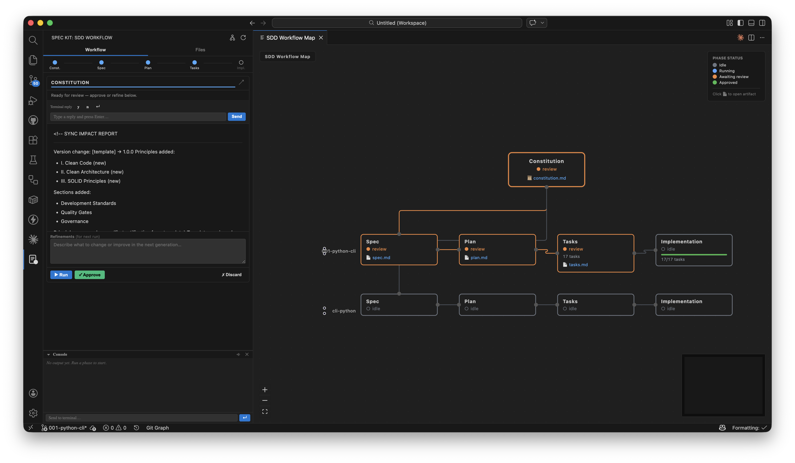

# DevStudio Assistant for VS Code


Visual orchestrator for Spec-Driven Development with DevStudio Factory, directly inside VS Code.

DevStudio Assistant gives you a guided phase-by-phase workflow in the sidebar — from constitution to implementation — with review gates, live console feedback, an interactive task checklist, stale-phase alerts, and a full DAG visualization of your entire project.



## Why use this extension

- Run the full SDD flow without leaving VS Code.
- Keep generated artifacts organized under `.factory/` and `specs/`.
- Approve or discard each phase with explicit review gates.
- Reply to AI terminal prompts directly from the sidebar UI.
- Switch AI backends (`claude`, `gemini`, `copilot`, `openai`) with one setting.
- Visualize your entire project as an interactive DAG with live status.

## Features

### Guided SDD Workflow

Dedicated activity bar view with five sequential phases per feature:

| Phase | Artifact |
|---|---|
| Constitution | `.factory/memory/constitution.md` |
| Specification | `specs/<feature>/spec.md` |
| Planning | `specs/<feature>/plan.md` |
| Tasks | `specs/<feature>/tasks.md` |
| Implementation | Code changes in your workspace |

Each phase moves through four states: **idle → running → awaiting review → approved**.

### SDD Workflow Map (DAG)

Open a full-screen interactive graph of your entire project via the toolbar button or **DevStudio: Open Workflow Map** from the Command Palette.

- Constitution node at the top, with one feature row per feature below.
- Phase nodes colour-coded by status (idle / running / awaiting review / approved).
- Animated edges while a phase is running.
- **Tasks node** shows the total task count derived from `tasks.md`.
- **Implementation node** shows a live progress bar (`X/N tasks`) that updates as you tick checkboxes in the sidebar.
- Click any artifact link (📄) to open it in the editor.
- Minimap and zoom controls included.

### Inline Task Checklist

When the Tasks phase has content, the sidebar renders an interactive checklist directly from `tasks.md`:

- Tick checkboxes without opening the file — changes are written to disk immediately.
- Progress bar (`done / total`) updates in real time.
- The DAG Implementation node reflects the same progress.

### Stale Phase Alerts

If you discard and re-run a phase after downstream phases were already approved, those phases are automatically flagged with a visible warning:

> ⚠ An earlier phase was re-run — this approved output may be outdated. Consider re-running.

Discarding the Constitution marks every feature phase as stale. The flag clears when you approve or discard the stale phase.

### Clarification Templates

Each feature phase offers a **↙ template** button that pre-fills the clarification field with a structured scaffold:

| Phase | Template sections |
|---|---|
| Specification | Goal / User persona / Acceptance criteria / Out of scope |
| Planning | Stack & constraints / Architecture / Dependencies / Open questions |
| Tasks | Task preferences / Steps to expand / Steps to skip |
| Implementation | Patterns to follow / Conventions / Do not change |

### Console Panel

- Live terminal output stream from the AI agent.
- Automatic prompt detection with quick-reply buttons (`y`, `n`, numbered options).
- Manual input field for custom replies.

### File Explorer

Browse all generated markdown artifacts grouped by feature, with kind icons (📜 constitution, 📋 spec, 🗺 plan, ✅ tasks).

## Requirements

- VS Code `^1.93.0`
- A workspace folder open in VS Code
- `devstudio` CLI available in your shell PATH
- At least one configured AI CLI:
  - `claude` (Anthropic)
  - `gemini` (Google)
  - `ghcs` (GitHub Copilot CLI)
  - `codex` (OpenAI Codex CLI)

## Quick Start

1. Open your project folder in VS Code.
2. Click the DevStudio Assistant icon in the activity bar.
3. If `.factory/` is missing, choose an AI agent and click **Initialize DevStudio**.
4. Run the **Constitution** phase and approve it.
5. Create a feature, then run each phase in sequence and approve.
6. Open the **Workflow Map** (toolbar button) to see the full DAG at any time.

Generated docs are organized as:

```text
.factory/memory/constitution.md
specs/<feature-name>/spec.md
specs/<feature-name>/plan.md
specs/<feature-name>/tasks.md
```

## Commands

| Command | Description |
|---|---|
| `devstudio.assistant.openDag` | Open the DevStudio Workflow Map in a new editor tab |
| `devstudio.assistant.refreshFiles` | Refresh DevStudio files and workflow state |
| `devstudio.assistant.openInEditor` | Open a generated file in the editor |

## Extension Settings

| Setting | Type | Default | Description |
|---|---|---|---|
| `devstudio.assistant.aiAgent` | `string` | `claude` | AI backend to run workflow phases (`claude`, `gemini`, `copilot`, `openai`) |
| `devstudio.assistant.agentPath` | `string` | `""` | Optional custom executable path for the selected AI agent |

## Development

### Install dependencies

```bash
npm install
```

### Build

```bash
npm run build
```

### Watch mode

```bash
npm run dev
```

### Debug (Extension Development Host)

Open the repository as multi-root via `devstudio.code-workspace` — this ensures `${workspaceFolder}` in the launch configuration resolves to `projects/devstudio.assistant/`.

Press **F5** to launch the Extension Development Host. The default build task (`Ctrl+Shift+B`) runs automatically via `preLaunchTask` before the host starts.

A new VS Code window opens with the extension loaded. The DevStudio icon appears in the activity bar. Changes to source files require a rebuild (`Ctrl+Shift+B`) followed by **Reload Window** (`Ctrl+R`) in the Extension Development Host.

### Type check

```bash
npm run typecheck
```

### Tests

```bash
npm test
npm run test:coverage
```

## Package as VSIX

```bash
npm run vsix
```

This generates a `.vsix` file at the project root.

Install locally:

```bash
code --install-extension devstudio-assistant-0.1.4.vsix
```

## Troubleshooting

### `devstudio` command not found

Install DevStudio Factory CLI and make sure it is available in your PATH:

```bash
uv tool install devstudio-factory --from git+https://github.com/QLINK-Innovation-and-Technology/devstudio.git
```

### Agent CLI not found

Set `devstudio.assistant.agentPath` to the full executable path, or install the default CLI for your selected `devstudio.assistant.aiAgent`.

### No files appearing in the sidebar

- Confirm your workspace is open as a folder.
- Run **DevStudio: Refresh Files** from the Command Palette.
- Verify `.factory/` and `specs/` exist and are readable.

### Shell integration not available

The live console output requires VS Code shell integration (bash, zsh, fish, or PowerShell). If output is not streaming, ensure your terminal shell is supported and shell integration is enabled.

## License

MIT. See `LICENSE.md`.
